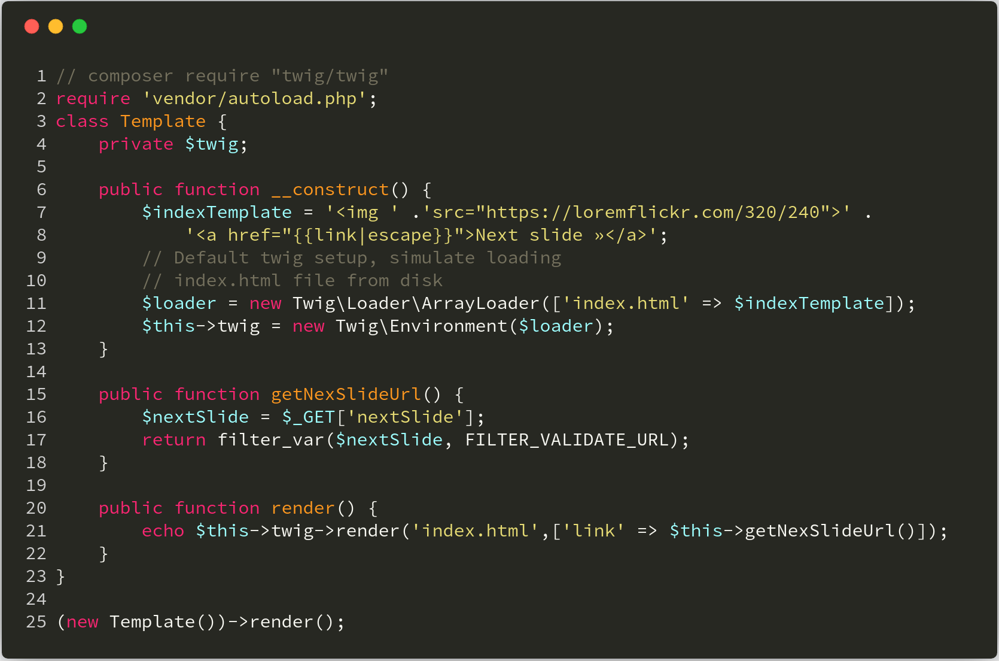
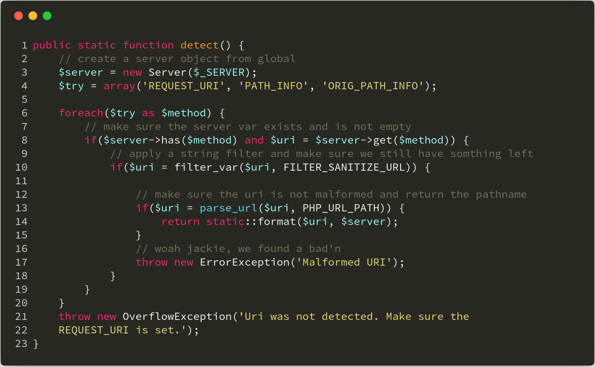
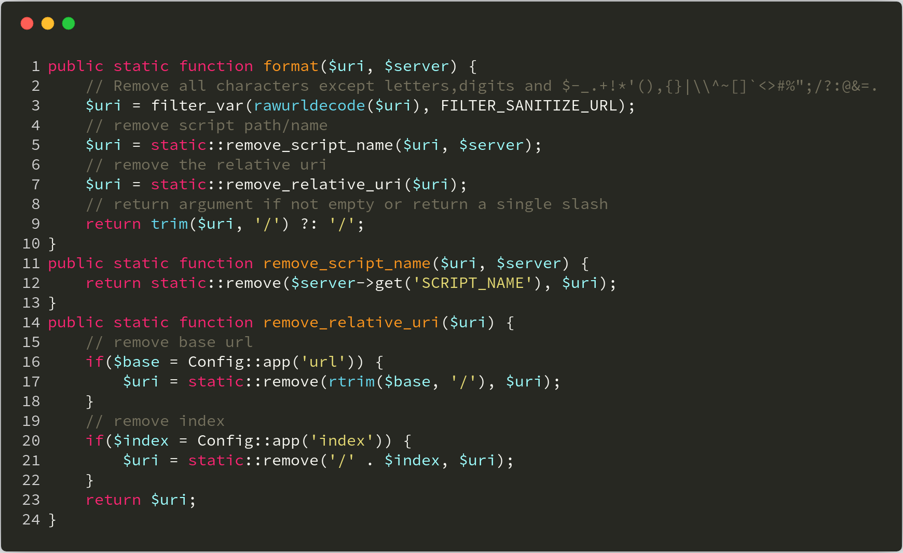
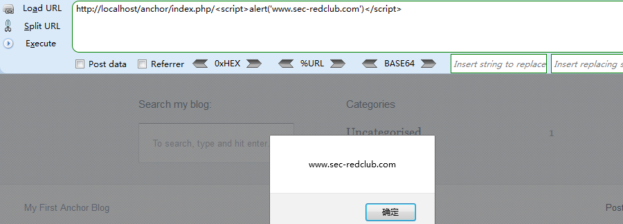
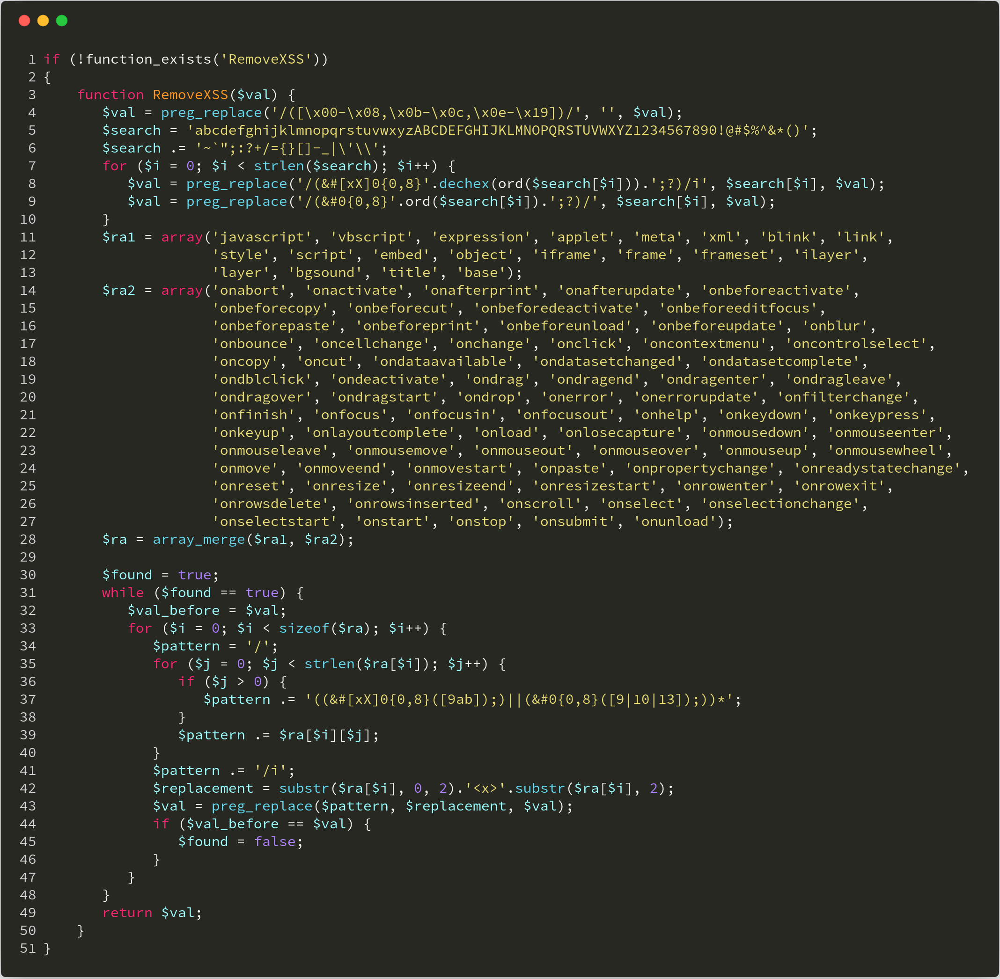

本文由红日安全成员： **七月火** 编写，如有不当，还望斧正。

## 前言

大家好，我们是红日安全-代码审计小组。最近我们小组正在做一个PHP代码审计的项目，供大家学习交流，我们给这个项目起了一个名字叫 **PHP-Audit-Labs** 。现在大家所看到的系列文章，属于项目 **第一阶段** 的内容，本阶段的内容题目均来自 [PHP SECURITY CALENDAR 2017](https://www.ripstech.com/php-security-calendar-2017/) 。对于每一道题目，我们均给出对应的分析，并结合实际CMS进行解说。在文章的最后，我们还会留一道CTF题目，供大家练习，希望大家喜欢。下面是 **第2篇** 代码审计文章：

## Day 2 - Twig

题目叫做Twig，代码如下：



**漏洞解析** ：

这一关题目实际上用的是PHP的一个模板引擎 [Twig](https://twig.symfony.com/) ，本题考察XSS(跨站脚本攻击)漏洞。虽然题目代码分别用了 **escape** 和 **filter_var** 两个过滤方法，但是还是可以被攻击者绕过。在上图 **第8行** 中，程序使用 [Twig](https://twig.symfony.com/) 模板引擎定义的 **escape** 过滤器来过滤link，而实际上这里的 **escape** 过滤器，是用PHP内置函数 **htmlspecialchars** 来实现的，具体可以点击 [这里](https://twig.symfony.com/doc/2.x/filters/escape.html) 了解 **escape** 过滤器， **htmlspecialchars** 函数定义如下：

> [ **htmlspecialchars** ](http://php.net/manual/zh/function.htmlspecialchars.php) ：(PHP 4, PHP 5, PHP 7)
>
> **功能** ：将特殊字符转换为 HTML 实体
>
> **定义** ：string **htmlspecialchars** ( string `$string` [, int `$flags` = ENT_COMPAT | ENT_HTML401 [, string`$encoding` = ini_get("default_charset") [, bool `$double_encode` = **TRUE** ]]] )
>
> ```bash
> & (& 符号)  ===============  &amp;
> " (双引号)  ===============  &quot;
> ' (单引号)  ===============  &apos;
> < (小于号)  ===============  &lt;
> > (大于号)  ===============  &gt;
> ```

第二处过滤在 **第17行** ，这里用了 **filter_var** 函数来过滤 **nextSlide** 变量，且用了 **FILTER_VALIDATE_URL** 过滤器来判断是否是一个合法的url，具体的 **filter_var** 定义如下：

>[ **filter_var** ](http://php.net/manual/zh/function.filter-var.php)： (PHP 5 >= 5.2.0, PHP 7)
>
>**功能** ：使用特定的过滤器过滤一个变量
>
>**定义** ：[mixed](http://php.net/manual/zh/language.pseudo-types.php#language.types.mixed) **filter_var** ( [mixed](http://php.net/manual/zh/language.pseudo-types.php#language.types.mixed) `$variable` [, int `$filter` = FILTER_DEFAULT [, [mixed](http://php.net/manual/zh/language.pseudo-types.php#language.types.mixed) `$options` ]] )

针对这两处的过滤，我们可以考虑使用 **javascript伪协议** 来绕过。为了让大家更好理解，请看下面的demo代码：


我们使用 **payload** ：`?nextSlide=javascript://comment％250aalert(1)` ，可以执行 **alert** 函数：


实际上，这里的 **//** 在JavaScript中表示单行注释，所以后面的内容均为注释，那为什么会执行 **alert** 函数呢？那是因为我们这里用了字符 **%0a** ，该字符为换行符，所以 **alert** 语句与注释符 **//** 就不在同一行，就能执行。当然，这里我们要对 **%** 百分号编码成 **%25** ，因为程序将浏览器发来的payload：`javascript://comment％250aalert(1)` 先解码成： `javascript://comment%0aalert(1)` 存储在变量 **$url** 中（上图第二行代码），然后用户点击a标签链接就会触发 **alert** 函数。

## 实例分析

本次实例分析，我们选取的是 **Anchor 0.9.2** 版本，在该版本中，当用户访问一个不存在的URL链接时，程序会调用404模板，而这个模板则存在XSS漏洞，具体代码如下：


该代码在 **themes\default\404.php** 中，看第4行 **code** 标签中的 **current_url** 函数，我们可在 **anchor\functions\helpers.php** 文件中，看到 **current_url** 函数是由 **Uri** 类的  **current** 方法实现的，具体代码如下：

```php
function current_url() {
	return Uri::current();
}
```

我们跟进到 **Uri** 类，在 **system\uri.php** 文件中，我们发现这里调用了 **static::detect** 方法( **statci::** 是在PHP5.3版本之后引入的延迟静态绑定写法)。


在 **current** 方法下面，我们就可以找到 **detect** 方法，该方法会获取 **$_SERVER** 数组中的 **'REQUEST_URI' 、'PATH_INFO', 、'ORIG_PATH_INFO'** 三个键的值(下图第3-4行代码)，如果存在其中的某一个键，并且符合 **filter_var($uri, FILTER_SANITIZE_URL)** 和 **parse_url($uri, PHP_URL_PATH)** ，则直接将 **$uri** 传入 **static::format** 方法(下图第10-14行代码，具体代码如下：



我们跟进 **static::format** 方法，可以发现程序过滤了三次(下图第3-7行)，但是都没有针对XSS攻击进行过滤，只是为了获取用户访问的文件名，具体代码如下：



由于没有针对XSS攻击进行过滤，导致攻击十分容易，我们来看看XSS攻击具体是如何进行的。

## 漏洞利用

我们构造payload如下：  `http://localhost/anchor/index.php/<script>alert('www.sec-redclub.com')</script>` 。根据上面的分析，当我们访问这个并不存在的链接时，程序会调用404模板页面，然后调用 **current_url** 函数来获取当前用户访问的文件名，也就是最后一个 **/** 符号后面的内容，所以最终payload里的 `<script>alert('www.sec-redclub.com')</script>` 部分会嵌入到 `<code>` 标签中，造成XSS攻击，效果图如下：



## 修复建议

这对XSS漏洞，我们最好就是过滤关键词，将特殊字符进行HTML实体编码替换，这里给出的修复代码为Dedecms中防御XSS的方法，大家可以在 **uploads/include/helpers/filter.helper.php** 路径下找到对应代码，具体防护代码如下：



## 结语

看完了上述分析，不知道大家是否对 **filter_var** 函数绕过有了更加深入的理解，文中用到的CMS可以从 [这里](https://github.com/anchorcms/anchor-cms/releases?after=0.9.3-a) 下载，当然文中若有不当之处，还望各位斧正。如果你对我们的项目感兴趣，欢迎发送邮件到 hongrisec@gmail.com 联系我们。 **Day2** 的分析文章就到这里，我们最后留了一道CTF题目给大家练手，题目如下：

```php
// index.php
<?php 
$url = $_GET['url'];
if(isset($url) && filter_var($url, FILTER_VALIDATE_URL)){
    $site_info = parse_url($url);
    if(preg_match('/sec-redclub.com$/',$site_info['host'])){
        exec('curl "'.$site_info['host'].'"', $result);
        echo "<center><h1>You have curl {$site_info['host']} successfully!</h1></center>
              <center><textarea rows='20' cols='90'>";
        echo implode(' ', $result);
    }
    else{
        die("<center><h1>Error: Host not allowed</h1></center>");
    }

}
else{
    echo "<center><h1>Just curl sec-redclub.com!</h1></center><br>
          <center><h3>For example:?url=http://sec-redclub.com</h3></center>";
}

?>
```

```php
// f1agi3hEre.php
<?php  
$flag = "HRCTF{f1lt3r_var_1s_s0_c00l}"
?>
```

题解我们会阶段性放出，如果大家有什么好的解法，可以在文章底下留言，祝大家玩的愉快！

## 相关文章

[Anchor CMS 0.9.2: XSS](https://curesec.com/blog/article/blog/Anchor-CMS-092-XSS-53.html)


